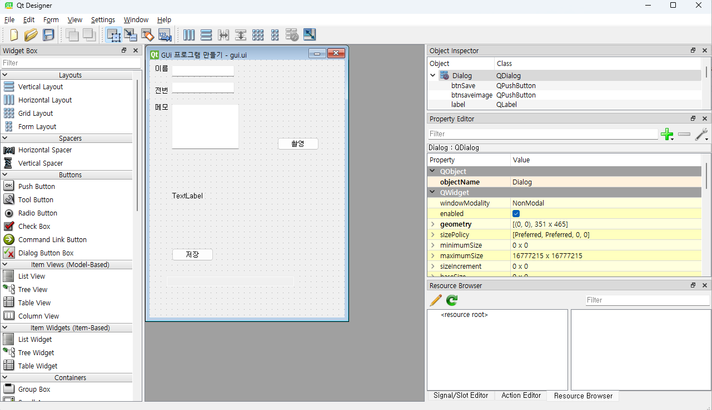
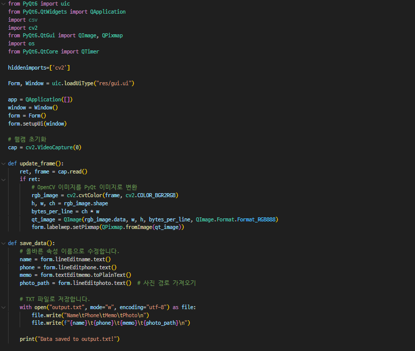
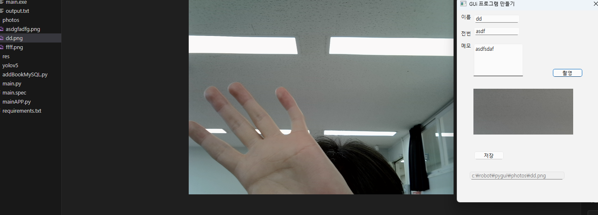
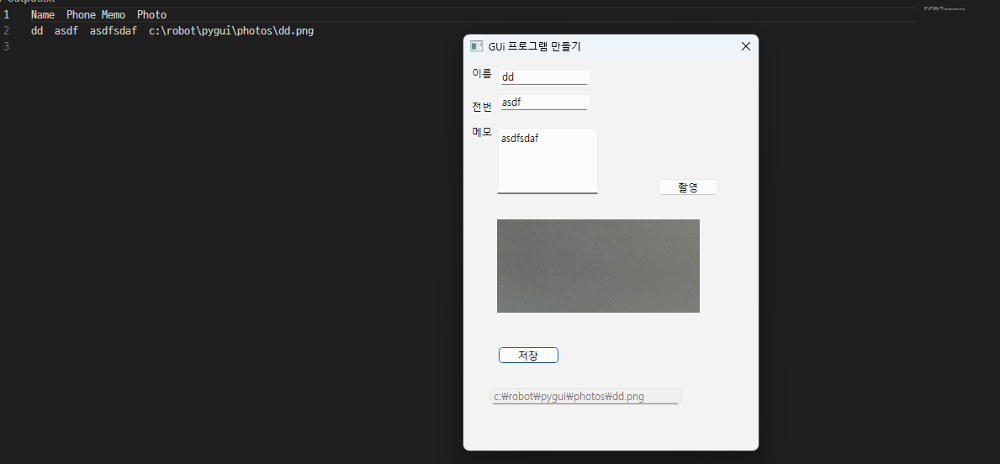
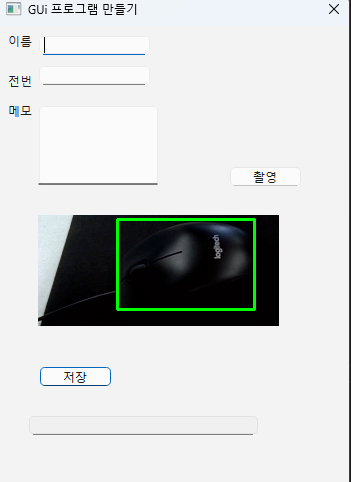

# yolo-pyqt

1. qt designer 활용

qt designer를 활용하여 gui를 만들어줍니다.

2. visual studio code를 이용해서 이름,전화번호,메모를 txt파일로 저장 할수 있도록 만들고 웹캠을 이용해 촬영과 저장 이미지 이름을 설정하여 photo폴더에 저장하도록 만들었습니다.

3. 프로그램 실행 후 촬영 버튼을 누르면 웹캠에 나와있는 사진 저장은 photos 파일에 이름,전화번호,메모는 output.txt 파일에 저장되도록 하였습니다.

4. 전에 만들었던 pothole.pt 파일을 활용해 사물을 감지하고 주소록 프로그램과 통합 적용

파일 복사

pt 파일을 넣어주고 copilot에게 통합 하는 법을 물어보고 코드 수정

실행

